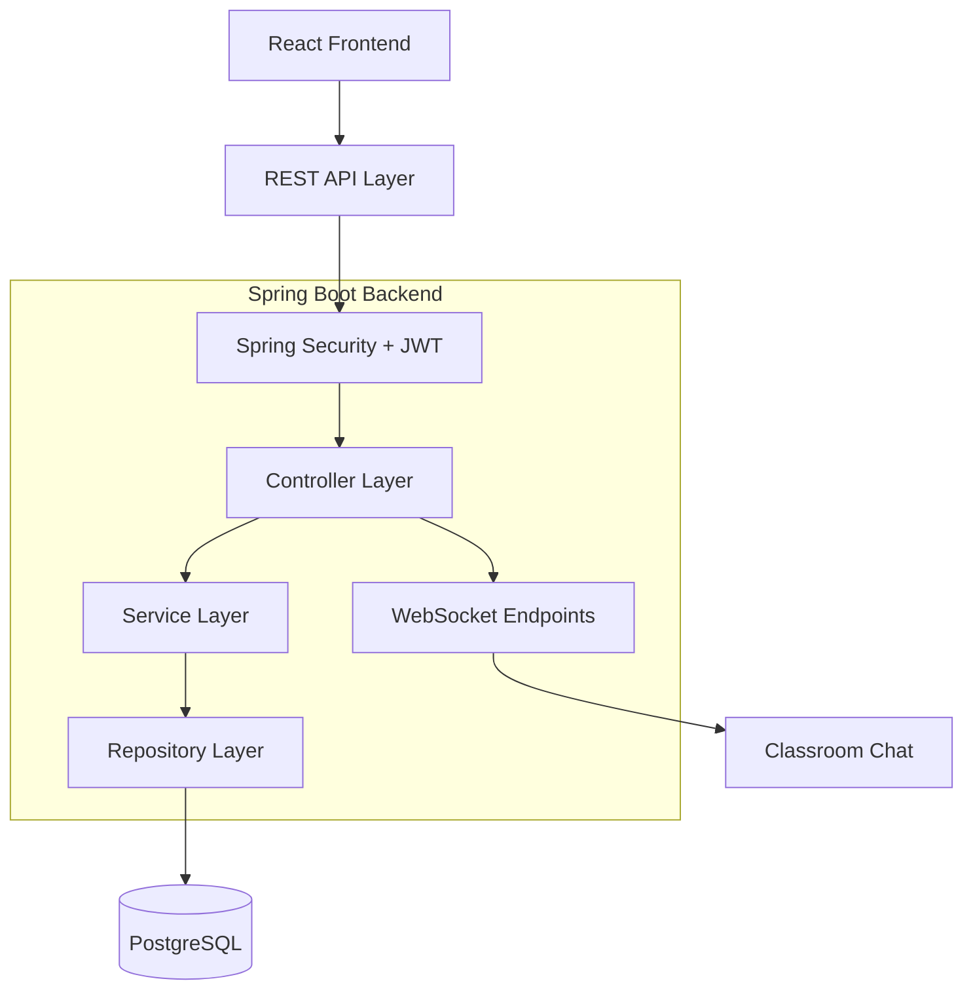

# EduConflux

### Unify. Educate. Elevate.

**EduConflux** is an institution management platform designed to bring academic administration, classroom collaboration, attendance tracking, scheduling, and user management into a unified digital workspace.

Built with **Spring Boot, React, and PostgreSQL**, EduConflux provides role-based experiences for administrators, faculty members, and students through a secure, modular, and maintainable architecture.

---

## Overview

Educational institutions often rely on disconnected systems to manage academic operations, communicate with students, maintain attendance records, and coordinate classes.

EduConflux aims to simplify these workflows through a centralized platform that connects institutional administration with everyday academic activities.

The platform follows a modular architecture, separating identity management, academic configuration, curriculum, timetabling, attendance, and classroom collaboration into distinct functional areas.

### Key Objectives

- Centralize institutional and academic management.
- Simplify student and faculty administration.
- Streamline course allocation, enrollment, and scheduling.
- Enable reliable attendance tracking and reporting.
- Provide collaborative virtual classrooms with announcements, memberships, and chat.
- Enforce secure authentication and role-based authorization.
- Maintain clean, modular, and extensible application architecture.

---

## Features

### 1. Identity and Access Management
- Secure login and authentication.
- JWT-based authentication.
- Role-based access control (RBAC).
- User account activation.
- Password recovery and password changes.
- Account status management.

### 2. Institution and User Administration
- Institution management.
- Centralized user directory.
- Student and faculty profile management.
- Search, filtering, and paginated listings.
- Account activation and deactivation.

### 3. Academic Configuration
- Academic year management.
- Department and program configuration.
- Semester management.
- Course creation and classification.
- Class section management.

### 4. Curriculum and Enrollment
- Course offerings for academic semesters.
- Faculty-to-course assignments.
- Student course enrollment.
- Enrollment status management.
- Academic structure and course allocation.

### 5. Timetable Management
- Weekly academic timetable.
- Timetable slot configuration.
- Classroom and location allocation.
- Course and section scheduling.
- Role-specific timetable views.

### 6. Attendance Management
- Faculty attendance register.
- Student roster-based attendance marking.
- Attendance records and history.
- Course-wise attendance percentages.
- Student attendance reports.

### 7. Virtual Classrooms
- Classroom creation and management.
- Classroom membership and invitations.
- Announcement and post feeds.
- Classroom member directories.
- Real-time classroom group chat.
- Private messaging support.

### 8. Role-Specific Dashboards
- **Administrator:** Institutional configuration, user management, and academic operations.
- **Faculty:** Teaching schedule, attendance, classrooms, and communication.
- **Student:** Academic timetable, attendance reports, enrolled classrooms, and announcements.

---

## Technology Stack

| Layer | Technology |
|---|---|
| Backend | Java 21, Spring Boot |
| Security | Spring Security, JWT, BCrypt |
| Persistence | Spring Data JPA, Hibernate |
| Database | PostgreSQL |
| Frontend | React |
| API Communication | REST APIs |
| Real-Time Communication | WebSocket |
| Containerization | Docker |
| Version Control | Git and GitHub |
| Build Tool | Maven |

---

## Architecture

EduConflux follows a layered backend architecture with a React frontend communicating with the backend through REST APIs.



### Architectural Principles

- **Separation of concerns:** Controllers, services, and repositories have distinct responsibilities.
- **Modularity:** Functional domains are organized into independent, cohesive modules.
- **Security by design:** Authentication and authorization are enforced at the backend.
- **Maintainability:** Clear boundaries and reusable components simplify future changes.
- **Data integrity:** Relational modeling and database constraints help preserve consistency.
- **Extensibility:** New academic and administrative capabilities can be introduced without redesigning the entire system.

---

## Project Structure

The repository is organized around a backend application and a frontend client.

```text
EduConflux/
├── educonflux-backend/
│   ├── src/
│   │   ├── main/
│   │   │   ├── java/
│   │   │   │   └── com/projects/EduConflux/
│   │   │   └── resources/
│   │   └── test/
│   ├── pom.xml
│   └── Dockerfile
│
├── educonflux-client/
│   ├── src/
│   ├── public/
│   ├── package.json
│   └── ...
│
├── compose.yaml
└── README.md
```

*Note: The tree is illustrative. Adjust filenames and folders to match the actual repository, especially the Docker Compose and frontend configuration files.*

---

## Getting Started

### Prerequisites

Install the following before running the project:

- Java Development Kit (JDK) 21
- Maven, or use the project's Maven Wrapper if available
- Node.js and npm
- PostgreSQL, locally or through Docker
- Git

### 1. Clone the Repository

```bash
git clone <YOUR_REPOSITORY_URL>
cd EduConflux
```

### 2. Configure the Database

Create a PostgreSQL database for EduConflux and configure the backend's database connection using environment variables or the application's configuration file.

Typical configuration values include:

```properties
spring.datasource.url=${DATABASE_URL}
spring.datasource.username=${DATABASE_USERNAME}
spring.datasource.password=${DATABASE_PASSWORD}
```

Set these variables to match your PostgreSQL connection. Use the JDBC URL format expected by Spring Boot, and enable SSL where required by your database provider.

Configure the project's JPA schema-management settings and database migrations according to the existing backend implementation.

### 3. Run the Backend

```bash
cd educonflux-backend
```

Configure the required environment variables, then run:

```bash
./mvnw spring-boot:run
```

On Windows, use:

```powershell
.\mvnw.cmd spring-boot:run
```

If the Maven Wrapper is not included, use `mvn spring-boot:run` with Maven installed.

### 4. Run the Frontend

Open a separate terminal:

```bash
cd educonflux-client
npm install
npm run dev
```

Use the development command defined in the frontend's `package.json`. Configure the frontend API base URL to point to the running backend.

### 5. Verify the Application

Once both applications are running:

1. Open the frontend's local development URL.
2. Verify that the backend is reachable.
3. Test authentication and role-specific navigation.
4. Verify that API requests connect successfully to PostgreSQL.

**Configuration note:** Actual port numbers, environment variable names, migration commands, and available npm scripts depend on the repository configuration.

---

## Security

EduConflux is designed around the following security practices:

- JWT-based authentication.
- Role-based authorization for protected operations.
- BCrypt password hashing.
- Backend validation of incoming requests.
- Controlled access to administrative and academic resources.
- Environment-based configuration for database credentials and secrets.
- Secure handling of classroom and user-related data.

Security-sensitive configuration must not be committed to version control. Production deployments should also use HTTPS, appropriate token expiration and revocation strategies, and restrictive database permissions.

---

## UI and User Experience

The EduConflux interface follows a modern SaaS design direction inspired by the clarity and restraint of Linear.

### Design Principles

- Minimal layouts with clear visual hierarchy.
- Orange-led branding with white surfaces and dark charcoal typography.
- Consistent navigation and reusable UI components.
- Data-focused dashboards, tables, and analytics.
- Role-specific navigation for administrators, faculty, and students.
- Responsive layouts for desktop, tablet, and mobile screens.
- Accessible forms, clear validation messages, and meaningful loading and error states.

The landing page introduces the platform, while authenticated users enter dashboards tailored to their roles.

---

## Development Roadmap

The following roadmap describes the intended product scope; individual items should be marked complete only after implementation and testing.

- [ ] Public landing page and authentication flows.
- [ ] Institution and user administration.
- [ ] Academic years, departments, programs, semesters, and courses.
- [ ] Student and faculty directories.
- [ ] Course offerings and faculty assignments.
- [ ] Student enrollment management.
- [ ] Timetable configuration and dashboards.
- [ ] Faculty attendance register.
- [ ] Student attendance reports.
- [ ] Classroom posts, memberships, and invitations.
- [ ] Real-time classroom chat and private messaging.
- [ ] Responsive UI and accessibility improvements.
- [ ] Automated testing and deployment hardening.

---

## Engineering Practices

The project aims to follow established software engineering practices:

- Layered and modular design.
- SOLID principles and separation of concerns.
- Meaningful naming and consistent code conventions.
- Validation and centralized exception handling.
- Database constraints and transactional service operations.
- Automated unit and integration testing.
- Git-based version control and incremental development.
- Environment-specific configuration.
- Containerized development and deployment where appropriate.

---

## Project Scope

EduConflux v1 targets a **single educational institution**. Its initial architecture prioritizes reliable institutional workflows, secure access, and maintainable domain modules rather than introducing multi-tenancy prematurely.

Future extensions may include broader analytics, additional integrations, and other institutional workflows as requirements evolve.

---

## Contributing

Contributions and improvements should follow the existing architecture and coding conventions.

1. Create a feature branch.
2. Implement changes within the appropriate module.
3. Add or update tests where applicable.
4. Verify backend and frontend functionality.
5. Submit a pull request with a concise description of the changes.

---

## License

Add the appropriate license before distributing or reusing the project. Until a license is specified, all rights remain with the applicable copyright holder.

---

**EduConflux — One platform. Every stakeholder.**
